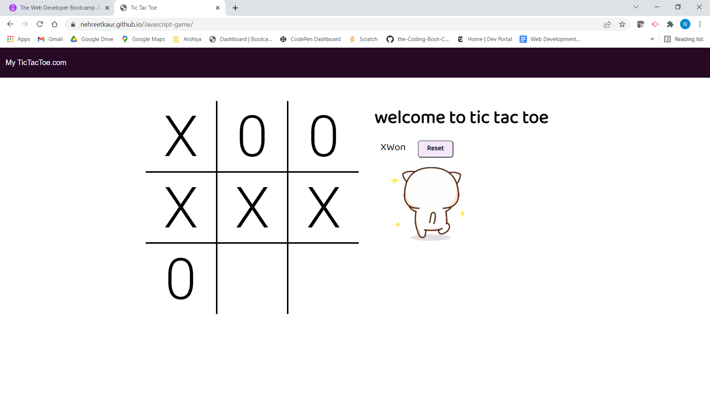

# About

**Developed** a very fun game application based on on very popular
game **Tic Tac Toe**.
In this, User can play and added some sound effects as well for more happy experience.My main motivation to build this game is to have solid foundation for **Javascript Skills** .

# Description
In this application, user can play by putting X and 0 in the
provided boxes. If the user is successful in putting all X's in one row straight , X is declared winner. And who ever taking turns either it's X or 0 , it will be updated accordingly. 
Also, fun **Gif** image is added when X or 0 , either one 
win the game. At each turn, some sound effets are added too.

# TABLE OF CONTENTS
[ Description](#Description)

[INSTALLATION](#INSTALLATION)

[TEXT-EDITOR](#TEXT-EDITOR)

[PROGRAMMING-LANGUAGE](#PROGRAMMING-LANGUAGE)

[RESOURCES-REFERRED](#RESOURCES-REFERRED)

[SCREENSHOT](#SCREENSHOT)

[GIT_HUB-REPOSITORY](#GIT_HUB-REPOSITORY)

[GIT_HUB-Deployed-Link](#GIT_HUB-Deployed-Link)

## TEXT-EDITOR
**Vs-code**

## PROGRAMMING-LANGUAGE

CSS

JAVASCRIPT

HTML via HANDLEBARS

# RESOURCES-REFERRED
[Tutorial](https://www.youtube.com/watch?v=B3pmT7Cpi24&t=303s)

[Tutorial](https://www.youtube.com/watch?v=sSLGP-_2gOI)

# SCREENSHOT

# GIT_HUB-REPOSITORY
[GIT-HUB](https://github.com/nehreetkaur/Javascript-game)

# GIT_HUB-Deployed-Link
[GIT-HUB](https://nehreetkaur.github.io/Javascript-game/)